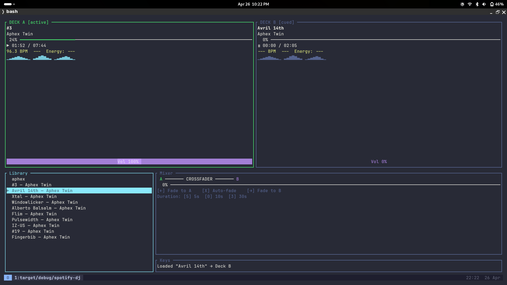

# spotify-dj

A Traktor-style terminal DJ app for Spotify. Dual decks, crossfader, BPM/key display, and a real-time frequency visualizer — all in your terminal.



**Requires Spotify Premium.**

## Setup

### 1. Create a Spotify Developer App

1. Go to [developer.spotify.com/dashboard](https://developer.spotify.com/dashboard)
2. Create a new app
3. Add `http://127.0.0.1:8888/callback` as a Redirect URI
4. Copy your **Client ID**

### 2. Configure

On first run, a config file is created at `~/.config/spotify-dj/config.toml`. Edit it:

```toml
[auth]
client_id = "your_client_id_here"

[playback]
device_name = "spotify-dj"
bitrate = 320

[ui]
crossfade_duration_secs = 10
default_volume = 80
```

### 3. Run

```sh
cargo run --release
```

Your browser will open for Spotify login on first run. Tokens are saved to `~/.config/spotify-dj/tokens.json` (mode 600).

## Keybindings

| Key | Action |
|-----|--------|
| `Tab` | Cycle focus between panels |
| `Q` | Quit |
| `/` | Search library |
| `L` | Load selected track → Deck A |
| `R` | Load selected track → Deck B |
| `Space` | Play / Pause active deck |
| `←` / `→` | Seek (deck focus) or move crossfader (mixer focus) |
| `X` | Auto-crossfade |
| `5` / `0` / `3` | Set crossfade duration (5s / 10s / 30s) |

## Implementation Status

- [x] Phase 1: TUI skeleton + OAuth2 auth
- [x] Phase 2: librespot playback core
- [x] Phase 3: Spotify Web API (search, audio features)
- [ ] Phase 4: Real-time FFT visualizer
- [x] Phase 5: Dual deck + crossfade
- [ ] Phase 6: Polish

## Notes

This app uses [librespot](https://github.com/librespot-org/librespot) for audio streaming, which uses
Spotify's internal protocols. It is intended for personal use only.
